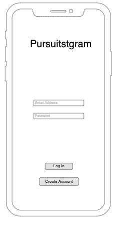
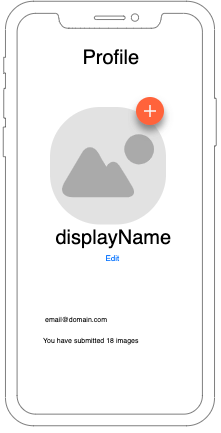
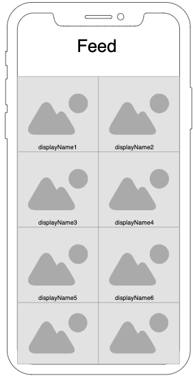
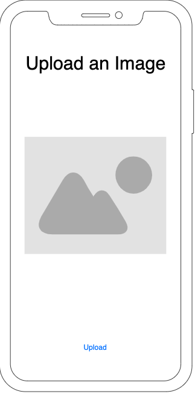
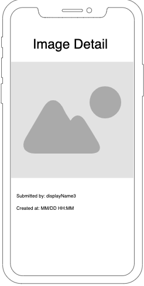

# Pursuit-Core-iOS-Firebase-Project

Build a Firebase-backed application that has the following functionality:

- Users can create an account and sign in
- Users can change their display name and profile image
- Users can upload an image
- Users can view images uploaded by other users in their feed
- Users can select an uploaded image to see more information about it

You are free to design the UI for it, but the following wireframes provide a rough sketch of the desired screens:

## Login View Controller

## Profile View Controller

## Feed View Controller

## Image Upload View Controller

## Image Detail View Controller

